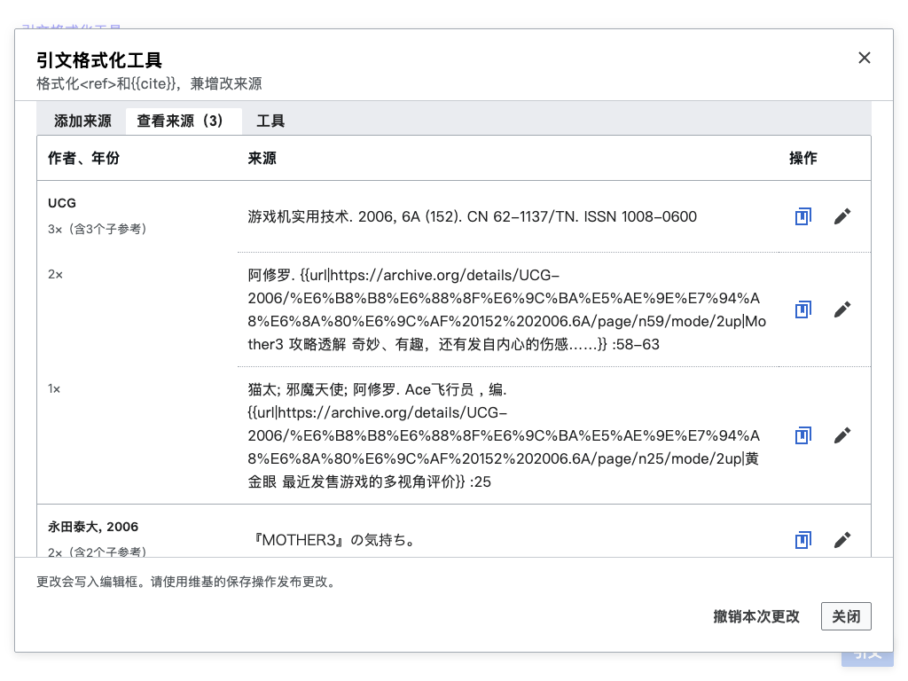
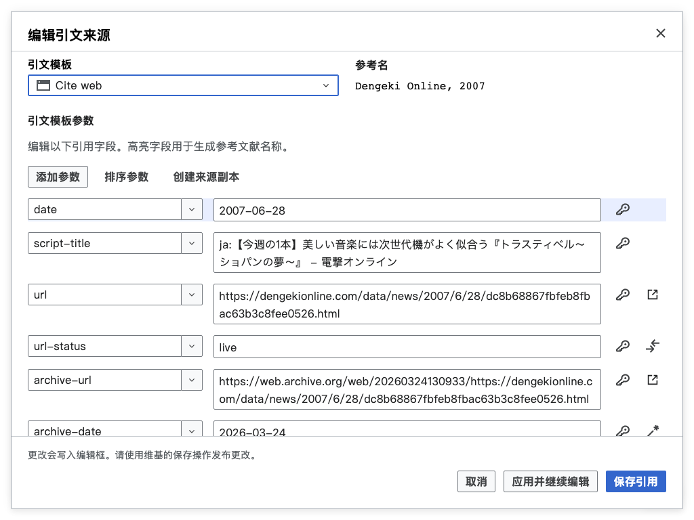

# Citation Formatter

A standalone MediaWiki gadget for creating, organizing, and reviewing citations
in the source editor. Review changes in the editor before publishing an article.

## Features




The screenshot excerpts from Chinese Wikipedia retain their
[CC BY-SA 4.0 license and contributor attribution](THIRD-PARTY-NOTICES.md).
All documentation images use a 1024 × 768 viewport at device pixel ratio 1.

- Create citations from URLs, identifiers, pasted text, or manual details.
- Browse, edit, and reuse sources, including shared sub-reference details.
- Format citation templates, normalize fields, and organize named references.
- Review citation issues and recover accepted changes during the session.
- Use English, Simplified Chinese, or Traditional Chinese Codex interfaces.

See the [control panel guide](docs/control-panel.md) for the workflow and the
[reference name guide](docs/reference-names.md) for naming conventions.

## How to use

Build with Node.js 24.14.1 or newer:

```sh
npm ci
npm run build
```

Copy `dist/citation_formatter.min.js` into `Special:MyPage/common.js` or
install it as a site gadget. Userscript managers can install
`dist/citation_formatter.user.js` instead. See the
[installation guide](docs/installation.md) for site and userscript settings.

On an **Edit source** page, open **Citation Formatter** from page actions, the
toolbox, or its floating launcher. Native textareas, CodeMirror, and VisualEditor
source mode are supported. Accepted changes stay in the editor until publication.

For development, follow [Contributing](CONTRIBUTING.md) and
[architecture](docs/architecture.md), including the required
[Codex button hierarchy](https://doc.wikimedia.org/codex/latest/style-guide/using-links-and-buttons.html#types-and-order-of-buttons).
Use `npm run verify` to check changes and `npm run screenshots` to refresh
the documentation images with offline fixtures.

## License

Project-owned code is dedicated under [CC0 1.0 Universal](LICENSE). Wikimedia
data, screenshot excerpts, bundled Codex icons, and the HTML entity decoder
retain their applicable terms and attribution. See
[third-party notices](THIRD-PARTY-NOTICES.md).
