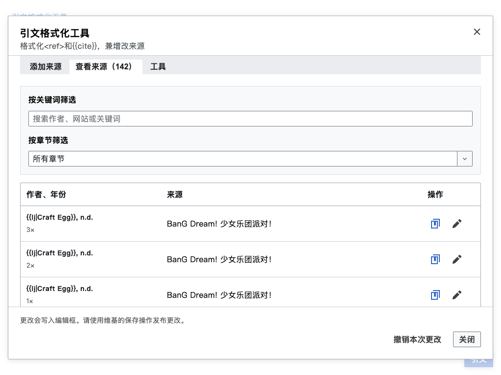

# Citation Formatter

[English](README.md) · [繁體中文](README.zh-Hant.md) · [简体中文](README.zh-Hans.md)

在 MediaWiki 原始碼編輯器中建立、整理及檢查引用來源。確認的修改會留在編輯器中，直到您發佈條目。

<!-- toc:start -->

## 目錄

- [主要功能](#主要功能)
- [安裝](#安裝)
- [使用方式](#使用方式)
- [畫面範例](#畫面範例)
- [說明](#說明)
- [授權](#授權)

<!-- toc:end -->

## 主要功能

- 使用網址、識別碼、貼上的文字或手動輸入的資料建立引用。
- 瀏覽、編輯及重用來源，包括共用的引用詳情。
- 格式化引用模板、檢查引用問題，並還原本次操作。
- 提供英文、繁體中文及簡體中文介面。

## 安裝

- **Tampermonkey：**開啟[最新可讀版使用者腳本](https://github.com/For-Each-Next/wp-citation-formatter/releases/latest/download/citation_formatter.user.js)，在腳本管理器中確認安裝。
- **MediaWiki：**下載[最新小工具檔案](https://github.com/For-Each-Next/wp-citation-formatter/releases/latest/download/citation_formatter.min.js)，將完整內容貼至 `Special:MyPage/common.js`，儲存並重新載入頁面。

選擇其中一種安裝方式，保留檔案中的授權聲明。

移除工具時，停用 Tampermonkey 中對應的腳本，或從 `common.js` 刪除工具程式碼，再重新載入維基百科。

## 使用方式

開啟條目的「編輯原始碼」，在頁面工具或浮動按鈕中選擇 Citation Formatter。您可新增、瀏覽或編輯來源，也可檢查格式化修改。確認對話方塊中的修改後，請先檢查條目再發佈。

詳見[操作指南](docs/control-panel.md)。支援原生原始碼文字框、目前的 MediaWiki CodeMirror 及 VisualEditor 原始碼模式。

## 畫面範例

截圖為離線瀏覽器中實際運行的畫面，以[BanG Dream! 條目修訂版本 94028176](https://zh.wikipedia.org/w/index.php?oldid=94028176)的原始碼為例。[截圖說明](docs/screenshots.md)列出測試資料與模擬服務。條目文字保留來源署名及 CC BY-SA 4.0 授權。

## 說明

維護資訊請參閱 [Contributing](CONTRIBUTING.md)、[架構](docs/architecture.md) 與[變更紀錄](CHANGELOG.md)。

## 授權

專案自有程式碼採用[CC0 1.0](LICENSE)。第三方程式碼、圖示、資料與條目摘錄保留原授權；詳見[第三方聲明](THIRD-PARTY-NOTICES.md)。
