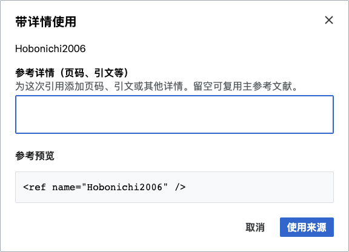

# Control panel

Open an article in Edit source or VisualEditor source mode, then launch
Citation Formatter from the page actions, toolbox, or floating launcher.
The panel keeps citation work in the source editor.

## Add a source

Enter a URL, identifier, or citation text and choose the lookup action. Check
the returned details in the draft before inserting them. You can also select
a citation type and create a manual draft for print or offline material.
Existing named URL sources can be reused instead of creating duplicates.

The draft editor preserves populated custom fields when changing template
types. Formatting is an explicit action: opening an existing source does not
silently rewrite its parameter spelling or values. Review the wikitext preview
before inserting or updating the source.

## Browse and reuse

Use the sources tab to filter by keyword or article section. Source entries
show their author and year, title, and uses; the reference name is available
in the metadata tooltip. Choose the use action to insert a reference at the
cursor, or edit to open the source details.
Bibliography citations used by `{{sfn}}` retain their short-footnote behavior.
The tabs stay visible while the list scrolls. Use and edit actions appear as
icon buttons with tooltips, leaving more room for source titles.

Repeated uses of a named footnote share one source entry within their reference
group. Native sub-references with identical details share one row beneath their
source title. The row header shows the number of uses, such as **4×**.
**Reuse sub-reference** inserts a fresh call with the same details;
**Edit sub-reference** updates every matching use represented by that row.
Saving refreshes the list, and session undo can restore the change.

Solid dividers separate sources, and dotted dividers separate their
sub-reference details. The line beneath author/year shows the total uses and
how many are sub-references, such as **7× (with 3 sub-refs)**. While scrolling
through a source's sub-references, its main row stays visible beneath the tabs
until the next source replaces it.

[View the mobile source list](images/sub-reference-sources-mobile.png).

The main **Use source** action inserts its main reference. Hold **Ctrl** or
**Command** while clicking it to open **Use with details** and add a page,
timestamp, quotation, or other detail in a separate dialog. The details field
accepts wikitext, including templates such as
`{{URL|https://example.test/page|Page title}}`. Check the generated wikitext
preview before inserting the sub-reference at the cursor; its `details`
attribute shares the main reference name. Clearing the details when editing
a sub-reference row turns its matching uses into ordinary main-reference uses.

[View the mobile details dialog](images/reference-details-mobile.png).

## Format and review

The tools tab groups formatting, reference organization, and citation review.
Choose inline or block formatting and inspect options before applying a
transformation. Naming and reference-organization operations keep unsupported
syntax intact. See [reference names](reference-names.md) for the rules.

Formatting preserves each native sub-reference's `details` attribute while
organizing its shared main definition. References with the same name remain
separate across groups. An explicit `group=""` in article prose uses the default
group; definitions inside `<references group="note">` use that list's group,
including definitions with an empty group attribute.

Local checks provide immediate citation feedback. On English and Chinese
Wikipedia, saving a new citation also runs live CS1 validation; errors or an
unavailable checker keep the draft open. Existing-source edits normally use
local checks. The CS1 review tool performs an explicit article check and
rechecks changes made within that review. Other wikis use local validation.
Review individual findings, apply the fixes you want, and inspect the editor
before publishing. Session recovery can restore formatter changes while
protecting later unrelated edits.

## Interaction and layout

The panel uses Codex fields with accessible labels and visible validation.
Each button group has one primary action; secondary actions use neutral
buttons, and less frequent actions use quiet buttons. Individual source and
parameter actions use compact icon buttons with translated tooltips and
accessible labels. List controls and dialog footers use text buttons, with cancel
before the primary action in left-to-right interfaces. On narrow screens, footer
buttons stack with the primary action first. The reference-name preview shows
its populated components together, without separate labels or empty placeholders.
Source details and wikitext previews wrap or scroll within the dialog rather than
expanding the page.

These choices follow the Wikimedia [style guide][1], [button guidance][2],
and [form guidance][3]. Keyboard and screen-reader interaction comes from
the Codex components and semantic buttons and labels.

[1]: https://doc.wikimedia.org/codex/latest/style-guide/overview.html
[2]: https://doc.wikimedia.org/codex/latest/style-guide/using-links-and-buttons.html#types-and-order-of-buttons
[3]: https://doc.wikimedia.org/codex/latest/style-guide/constructing-forms.html
